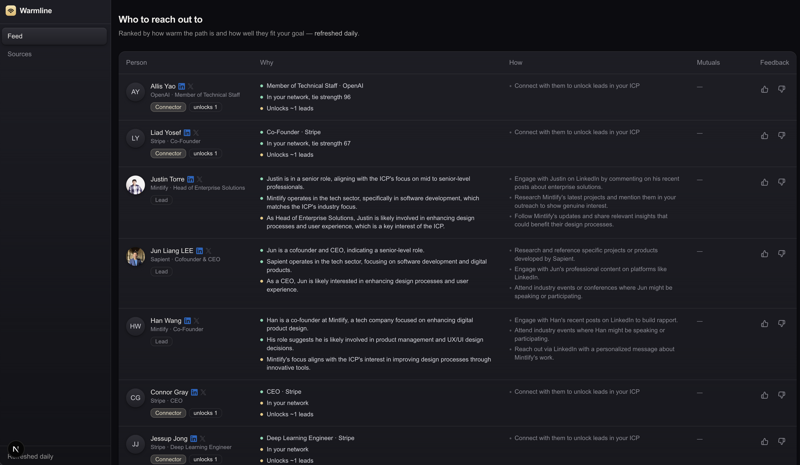

# Warmline

**The For You feed for your warm network.**

Everyone's automating *cold* outreach: faster spam, racing to the bottom. Warmline plays the other game. The highest-converting lead is a **warm intro**, usually sitting **one person away**, scattered across your Gmail, a cofounder's LinkedIn, and an event you both almost went to.

Tell Warmline your goal once. A proactive agent surfaces the intro you didn't know existed and tells you **how** to make it land: channel, angle, and a drafted opener.

Built for the **YC AI Growth Hackathon** (24-hour build).



## What makes it different

- **Proactive, not reactive**: pushes the intro you didn't ask for.
- **2nd / 3rd degree**: finds the *gatekeeper* who unlocks many targets at once.
- **Serendipity layer**: fuses event RSVPs and social signal into an attendance-confidence score.
- **Tailored ranking**: thumbs up / down visibly reorders the feed.

## How it works

- **Warm signal**: Google contacts / calendar / Gmail for 1st-degree connections.
- **Reach & enrichment**: [Fiber](https://fiber.ai/) for live LinkedIn / X data across 2nd/3rd degree.
- **Proactive agent**: a Convex cron ranks leads against your goal and traces the warm path.
- **Why + How**: every lead ships with reasoning and a drafted opener. Draft only, never auto-sent.
- **CSV export**: one file every CRM imports.

## How Convex powers Warmline

Convex is the entire backend runtime. Every piece of server-side logic is a Convex function.

- **Schema + typed queries**: graph tables (`persons`, `edges`, `recommendations`, `icp`, `feedback`, `personVectors`) with explicit indexes and generated TypeScript bindings.
- **Realtime**: the feed (`api.feed.list`) is a `query`; the client `useQuery` updates live on re-rank or thumbs-up, no polling.
- **Actions**: long-running work (Firecrawl scrape, OpenAI ICP, embeddings, Fiber API) runs in `action`s with no timeout.
- **Cron**: `convex/crons.ts` runs daily at 13:00 UTC: recompute graph, re-rank, upsert, server-side, no external orchestrator.
- **Vector search**: `personVectors` vector index (1536-dim) fuses cosine similarity with warm-reachability for the final score.
- **File storage**: uploaded exports (LinkedIn / Twitter ZIP, Luma CSV) stored via signed PUT URLs.
- **Auth**: `@convex-dev/auth` password sign-in, no third-party service.

## Tech stack

- [Convex](https://convex.dev/): backend, realtime, cron
- [Fiber](https://fiber.ai/): live people / company data
- [OpenAI](https://openai.com/): LLM reasoning + embeddings
- [Next.js](https://nextjs.org/) + [React](https://react.dev/) + [Tailwind](https://tailwindcss.com/)
- [Better Design](https://better-design.com/): design system and UI/UX
- [Convex Auth](https://labs.convex.dev/auth): authentication

## Get started

```bash
npm install
npm run dev
```

Set the required keys (see `.env.example`):

- `FIBER_API_KEY`: get one at <https://fiber.ai/app/api>
- `OPENAI_API_KEY`
- Google OAuth credentials for warm-signal access

## Learn more

- [Convex docs](https://docs.convex.dev/) · [Convex Auth](https://labs.convex.dev/auth)
- [Fiber API docs](https://api.fiber.ai/docs/): start at [`llms.txt`](https://api.fiber.ai/llms.txt)
